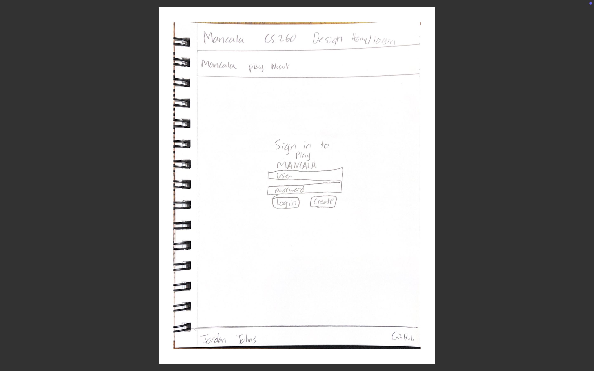
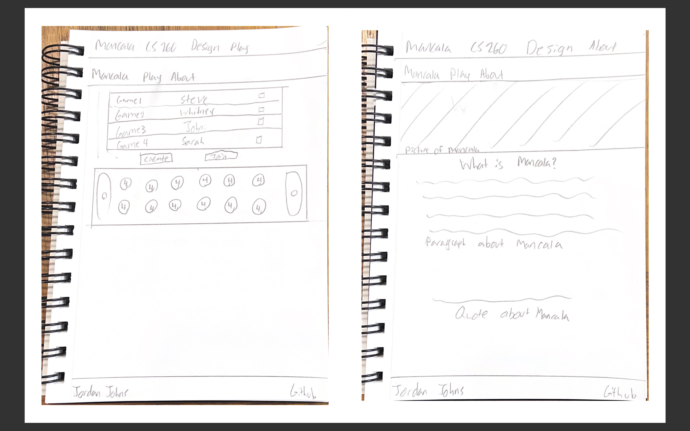

# PlayMancala

[My Notes](notes.md)

My startup application is to create an online game site for mancala. Clients will be able to login and challenge other players to a game of mancala. They will be able to create games or join existing games and then play through a game of mancala taking turns until the game is over.

## 🚀 Specification Deliverable

### Elevator pitch

Did you grow up playing the amazing game Mancala, but now no longer have the physical game? Or do you wish you could play Mancala with friends who live far away? Well you have found your solution here at PlayMancala! This is a very easy to access site that lets you play the classic game of mancala anywhere with anyone! Whether you are new to the game or are a seasoned master, PlayMancala is the perfect solution for you.

### Design

### Key features

- Secure login over HTTPS
- Ability to play against other online players
- Ability to see a mancala board and play through to the end.
- Mancala rules will be developed into the game for greater ease of play.
- Ability to see other mancala games and join them if desired.
- Ability to create a new game.
- Admin can edit results and game status.

### Technologies

I am going to use the required technologies in the following ways.

- **HTML** - I will have 3 correctly structured html pages. One for logging in, one for playing, and one for reading about Mancala. I will have a navigation bar that persists on each page with links to the three pages.
- **CSS** - Appropriate styling of pages. Will design a basic mancala board.
- **React** - Achieve all desired functionality for buttons. This includes loging in, joining games, creating games, and turnstyle gameplay.
- **Service** - Will use an outside service to provide quotes on my about page.
- **DB/Login** - Will have a table to store login information. Will also have a table to store games.
- **WebSocket** - Realtime user to user data transfer for gameplay.

## 🚀 AWS deliverable

For this deliverable I did the following. I checked the box `[x]` and added a description for things I completed.

- [X] **Server deployed and accessible with custom domain name** - [My server link](https://jjohns-byu.click).

## 🚀 HTML deliverable

For this deliverable I did the following. I checked the box `[x]` and added a description for things I completed.

I added three html pages for the login, play, and about pages. I added some images to the Resources directory which were imported into the html pages.

I added nav elements to the header of each of the pages. I added an index page for the login, an about page to share some general information and serve up quotes from a server.

In the play page I have placeholders for where the mancala UI will be displayed and a table for the possible games to join as well.

I added placeholders for all future portions of the project.

- [X] **HTML pages** - I added three html pages with proper structure. They are, index, play, and about. 
- [X] **Proper HTML element usage** - I added proper html elements for headers, links, paragraph lines, tables, etc.
- [X] **Links** - I added a link to my github in the footer, and three nav links in the header to the three html pages.
- [X] **Text** - I added text in the about page explaining mancala and throughout the other pages as well.
- [X] **3rd party API placeholder** - I put a placeholder for a quote api generator in the about page.
- [X] **Images** - I added two images. One of mancala being played in the about page and the other is a placeholder for the game.
- [X] **Login placeholder** - I added a login placeholder for the index page.
- [X] **DB data placeholder** - I added a table to show the games database. Also the game itself will have its state stored in a database.
- [X] **WebSocket placeholder** - The game image is the websocket placeholder. There websocket will communicate moves made between two clients.

## 🚀 CSS deliverable

For this deliverable I did the following. I checked the box `[x]` and added a description for things I completed.

- [ ] **Header, footer, and main content body** - I did not complete this part of the deliverable.
- [ ] **Navigation elements** - I did not complete this part of the deliverable.
- [ ] **Responsive to window resizing** - I did not complete this part of the deliverable.
- [ ] **Application elements** - I did not complete this part of the deliverable.
- [ ] **Application text content** - I did not complete this part of the deliverable.
- [ ] **Application images** - I did not complete this part of the deliverable.

## 🚀 React part 1: Routing deliverable

For this deliverable I did the following. I checked the box `[x]` and added a description for things I completed.

- [ ] **Bundled using Vite** - I did not complete this part of the deliverable.
- [ ] **Components** - I did not complete this part of the deliverable.
- [ ] **Router** - Routing between login and voting components.

## 🚀 React part 2: Reactivity

For this deliverable I did the following. I checked the box `[x]` and added a description for things I completed.

- [ ] **All functionality implemented or mocked out** - I did not complete this part of the deliverable.
- [ ] **Hooks** - I did not complete this part of the deliverable.

## 🚀 Service deliverable

For this deliverable I did the following. I checked the box `[x]` and added a description for things I completed.

- [ ] **Node.js/Express HTTP service** - I did not complete this part of the deliverable.
- [ ] **Static middleware for frontend** - I did not complete this part of the deliverable.
- [ ] **Calls to third party endpoints** - I did not complete this part of the deliverable.
- [ ] **Backend service endpoints** - I did not complete this part of the deliverable.
- [ ] **Frontend calls service endpoints** - I did not complete this part of the deliverable.

## 🚀 DB/Login deliverable

For this deliverable I did the following. I checked the box `[x]` and added a description for things I completed.

- [ ] **User registration** - I did not complete this part of the deliverable.
- [ ] **User login and logout** - I did not complete this part of the deliverable.
- [ ] **Stores data in MongoDB** - I did not complete this part of the deliverable.
- [ ] **Stores credentials in MongoDB** - I did not complete this part of the deliverable.
- [ ] **Restricts functionality based on authentication** - I did not complete this part of the deliverable.

## 🚀 WebSocket deliverable

For this deliverable I did the following. I checked the box `[x]` and added a description for things I completed.

- [ ] **Backend listens for WebSocket connection** - I did not complete this part of the deliverable.
- [ ] **Frontend makes WebSocket connection** - I did not complete this part of the deliverable.
- [ ] **Data sent over WebSocket connection** - I did not complete this part of the deliverable.
- [ ] **WebSocket data displayed** - I did not complete this part of the deliverable.
- [ ] **Application is fully functional** - I did not complete this part of the deliverable.
